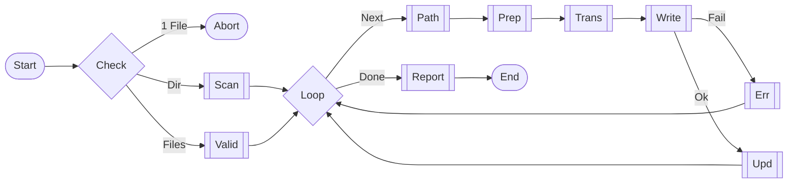

Batch compile .src.md. Validate/Scan/Schedule `pe_compile`. Supports `_ai/`, `_ai/.src/`, `ref/`, `skills/`, `commands/`. Aggregate TodoWrite.

## Constraints
- Dir/Multi-files only. Reject single file.
- Recursive scan. Sequential processing.
- `.src.md` only. Reject `AGENTS.md`.
- Reuse `pe_compile`. Prefer `Write`, fail fallback to Shell.

## Workflow

## [STEP-0] Input
- `$1...$N`: paths (req, >=2 files or >=1 dir).
- Logic: Remove `@`. Reject single file. Validate existence. Init `TodoWrite`.

## [STEP-0A] Scan
- Dir: `Glob(**/*.src.md)`. Exclude `AGENTS/CLAUDE.md`. Add to list.

## [STEP-0B] Valid
- Files: Dir->Scan. File->Check `.src.md`. Skip invalid. Add to list.

## [STEP-1] Paths
- Same as `pe_compile` [STEP-1].

## [STEP-2] Prep
- Ensure dir. Overwrite. `TodoWrite(in_progress)`.

## [STEP-3] Trans
- Reuse `pe_compile` [STEP-3].

## [STEP-4] Write
- `Write` or Shell. `TodoWrite(completed)`.

## [STEP-5] Err
- Shell fail -> Log. `TodoWrite(cancelled)`. Continue next.

## [STEP-6] Quality
- Same as `pe_compile` [STEP-6].
- **Token**: Abbr, short phrases.
  - **Limits**: `cursor`<50k, `windsurf`<20k, `antigravity`<12k.

## [STEP-7] Report
- Stats: Success/Skip/Fail/Time.
