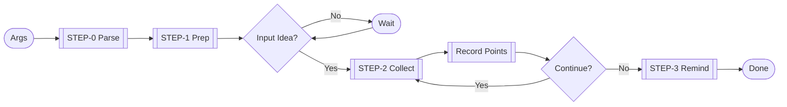

Guide user to complete Spec-Driven Design Step 1. Progressively collect/organize requirements, generate structured document.

## Workflow Diagram



# [STEP-0]: Parse Args
- `$1`: Locale (def: `zh_CN`). `$2`: Project Name (def: workspace dir).

# [STEP-1]: Prep
- Check/Init `.kiro/specs/project/requirements.md`.
- Identify `$1` language.
- Guide user to diverge thinking, describe ideal state.

# [STEP-2]: Collect Requirements
- **Listen/Guide**: Acknowledge divergent thinking. Architect perspective guide (Module/Scenario/Flow).
- **Record**: Extract key info (Align [APPENDIX-1]). Avoid copying.
- **Interact**: Respond only to clarify. User says "Stop" then end.
- **Iterate**: Continue until user "Done".
- **Wrap up**: Remind translate/record external links to `project/CLAUDE.md`.

```toon
examples[2]:
 - type: good
   description: Guide divergence
   userInput: Want remote collab system, only thought of smooth comms.
   tooling[1]: {name: Update, params: {path: ..., description: "Make remote team comms smoother"}}
   summary: |
     Recorded. Imagine the scenario when running perfectly? Feel free to share.
 - type: good
   description: Vague inspiration guide
   userInput: Want something AI related, not sure yet.
   summary: |
     Good direction. Talk about pain points or ideal picture first? Be specific so I can record.
```

## Locale Convention
- Default use `$1`. User specified exception.
- Document free text use `$1`. Fixed English title exception.
- Follow `$1` convention.

# [APPENDIX-1]: Format Specs

Markdown Format Specs:

```md
# [PROJECT_NAME:- $2] User Requirements Documentation
```
- Title: English, PascalCase. Fixed type.

### Introduction
```md
## Introduction
This document records detailed requirements for developing [Type] project...
```
- 2-5 sentences. `$1` language.

### Primary Persona
```md
**Primary Persona:** [Users]
```
- `$1` language list. Concise accurate.

### Operational Constraints (Opt)
```md
**Operational Constraints:**
1. [Constraint]
```
- Type: Base/Stack/Team/Compliance/Ops/Business.

### Non-Functional Priorities (Opt)
```md
**Non-Functional Priorities:**
1. [Priority]
```
- Explicit/Quantifiable.

### Deferred Scope (Opt)
```md
**Deferred Scope:**
1. [Feature]
```
- Future feature. Avoid repetition.

### Requirements (Core)
```md
## Requirements

### Requirement [N]: [Name]

**User Story:** As [Role], I want [Feature], so that [Value].

#### Acceptance Criteria

1. WHEN [Trigger] THEN [Result]
```

**Spec**:
1. **User Story**: Standard format. Role specific, Value clear.
2. **Acceptance Criteria**: Given-When-Then. Independent testable. Focus on business.
3. **Split**: Independent value. 2-5 ACs.

```toon
examples[2]:
 - type: good
   description: Complete requirement
   content: |
     ### Requirement 3: Work Management
     **User Story:** As Creator, I want manage works, so that edit/delete anytime.
     #### Acceptance Criteria
     1. WHEN login THEN show list (img/title/time/view)
     2. WHEN click edit THEN jump edit page
     3. WHEN delete THEN confirm twice
 - type: good
   description: Rec Algo
   content: |
     ### Requirement 5: Content Rec
     **User Story:** As Viewer, I want rec interested content, so that discover quality works.
     #### Acceptance Criteria
     1. WHEN browse home THEN rec based on history
     2. WHEN finish play THEN rec same author
```

### Priority (Opt)
- `[H]` High, `[M]` Medium, `[L]` Low.
