Recursively scan `_airef/<project>/src`, fix prompt hierarchy issues (conflicts/confusion/duplication/boundaries), and create missing `AGENTS.src.md` as needed.

## Workflow Diagram

```mermaid
flowchart LR
  Start([Receive $ARGUMENTS]) --> Step0[[STEP-0 Parse/Validate]]
  Step0 --> Val{Valid?}
  Val -->|No| Exit1([Exit: Invalid])
  Val -->|Non_airef| Exit2([Exit: Non_airef])
  Val -->|OK| Step1[[STEP-1 Scan]]
  Step1 --> Step2[[STEP-2 Hierarchy]] --> Step3[[STEP-3 Read]] --> Step4[[STEP-4 Check]]
  Step4 --> S4_1[[4.1 Conflicts]] --> S4_2[[4.2 Confusion]] --> S4_3[[4.3 Duplication]] --> S4_4[[4.4 Boundaries]] --> S4_5[[4.5 Audience]] --> S4_6[[4.6 Missing]]
  S4_6 --> Step5[[STEP-5 Fix]]
  Step5 --> S5_1[[5.1 Conflicts]] --> S5_2[[5.2 Confusion]] --> S5_3[[5.3 Duplication]] --> S5_4[[5.4 Boundaries]] --> S5_5[[5.5 Audience]]
  S5_5 --> S6{Create?}
  S6 -->|Yes| Step7[[STEP-6 Create]] --> Done([Done])
  S6 -->|No| Done
```



## [STEP-0] Parse/Validate

**Arguments**
- `$1` (project_path): Required. `_airef/<project>` or `_airef/<project>/src`.

**Process**
- Extract `$1`. IF empty THEN error and exit.
- Remove `/src` suffix. IF not starts with `_airef/` THEN error and exit.
- Construct source path `{$1}/src`. IF not exist/unreadable THEN error and exit.

```toon
examples[2]:
 - type: good
   description: Valid arguments
   content: |
     pe_airefscope _airef/compose-client
     pe_airefscope _airef/compose-client/src
 - type: bad
   description: Invalid arguments
   content: |
     pe_airefscope
     pe_airefscope _ai/src
```

## [STEP-1] Scan Directory

List `{source_dir}/**/*.src.md`.
- Record paths.
- Identify: `AGENTS` (Hierarchy), `README` (Description), `TODO` (Tasks), `SPEC-*` (Specs).
- IF no `.src.md` THEN error and exit.

```toon
type: good
description: Scan results
content: |
  - _airef/proj/src/AGENTS.src.md (L0)
  - _airef/proj/src/api/AGENTS.src.md (L1)
```

## [STEP-2] Build Hierarchy

Build hierarchy tree.
- L0: Files under source root. LN: Files under N-level subdirectories.
- Parent: Same-named file in parent directory.
- Record: Depth, Parent, Children list, Scope.

```toon
type: good
description: Hierarchy mapping
content: |
  L0: src/AGENTS.src.md (Parent: None, Children: [api/])
  L1: src/api/AGENTS.src.md (Parent: src/AGENTS.src.md)
```

## [STEP-3] Analyze Content

Read all `.src.md`.
- Extract: Role, Tasks, Constraints, Forbidden (NEVER), Workflow, Tech Stack, Boundaries.
- Identify patterns: Arch/Impl constraints, Tool specs, Style, Business rules.

```toon
examples[2]:
 - type: good
   description: Extract info
   content: |
     src/AGENTS.src.md: Role=Fullstack, Stack=React/TS, Forbidden=any type
 - type: good
   description: Identify patterns
   content: |
     L0: "Component Design" (Arch)
     L2: "Use react-hook-form" (Impl)
```

## [STEP-4] Consistency Checks

### [STEP-4.1] Context/Constraint Conflicts
Check contradictions between levels.
- **Items**: Parent-child constraint conflicts (MUST vs NEVER), deep level negating upper principles, definition/selection conflicts, internal self-contradiction.
- **Patterns**: Upper "Use A" Lower "Use B", "Prefer A" and "Avoid A" coexist.

```toon
examples[2]:
 - type: good
   description: Selection conflict
   content: |
     Upper: "State use Zustand"
     Lower: "Use Redux" -> Conflict
 - type: good
   description: Logic conflict
   content: |
     Upper: "MUST encapsulate side effects"
     Lower: "NEVER use useEffect" -> Conflict
```

### [STEP-4.2] Hierarchy Confusion
Check high-level over-specification.
- **Items**: High level contains impl details/specific functions/variable names, abstraction mismatch.
- **Patterns**: L0 contains function signatures/component internal impl.

```toon
examples[2]:
 - type: good
   description: High-level specific
   content: |
     L0: "UserForm use handleSubmit" -> Error, should abstract
 - type: good
   description: Correct abstraction
   content: |
     L0: "Form must have validation" -> Correct
```

### [STEP-4.3] Unreasonable Repetition
Check redundancy.
- **Items**: Constraints/Forbidden/Workflow repeated across levels, common specs not hoisted.
- **Patterns**: Child repeats parent verbatim, common specs scattered.

```toon
examples[2]:
 - type: good
   description: Redundancy
   content: |
     L0/L1/L2 all contain "NEVER modify DOM" -> Keep L0 only
 - type: good
   description: Reasonable refinement
   content: |
     L0: "Accessibility"
     L1: "Add ARIA" -> Reasonable
```

### [STEP-4.4] Responsibility Boundaries
Check boundaries/overlaps.
- **Items**: Unclear/Overlapping/Vacuum/Out-of-bound responsibilities, declaration mismatch.
- **Patterns**: Child involves out-of-scope modules, multiple children responsible for same thing.

```toon
examples[2]:
 - type: good
   description: Out of bound
   content: |
     UI component layer contains "DB query optimization" -> Out of bound
 - type: good
   description: Overlap
   content: |
     api/ and auth/ both responsible for "Auth" -> Overlap
```

### [STEP-4.5] Missing Sub-Hierarchies
Check missing `AGENTS.src.md`.
- **Items**: Subdirectories with code but no prompts.
- **Criteria**: Contains source (js/ts/vue etc), non-tool/temp dir, reasonable depth.

```toon
examples[2]:
 - type: good
   description: Missing
   content: |
     src/utils/ contains ts files but no AGENTS.src.md -> Missing
 - type: good
   description: No need to create
   content: |
     node_modules/, dist/ -> Ignore
```

### [STEP-4.6] Audience Separation
Check audience separation.
- **Items**: `AGENTS` (AI) contains verbose explanation; `README` (Human) contains AI instructions (MUST/NEVER).

```toon
examples[2]:
 - type: good
   description: Correct separation
   content: |
     AGENTS: Use Guard Clauses.
     README: Project overview...
 - type: bad
   description: Confusion
   content: |
     AGENTS: "This rule is important..." (Explanation)
     README: "MUST use pnpm" (Instruction)
```

## [STEP-5] Fix Issues

Auto-fix by priority.

### [STEP-5.1] Fix Conflicts
- **Strategy**: Prefer upper level. Unify tech selection. Eliminate self-contradiction.
- **Principle**: Lower level extends, not overthrows.

```toon
type: good
description: Fix conflict
content: |
  Before: Upper "Zustand", Lower "Redux"
  After: Lower "Use Zustand (Follow upper)"
```

### [STEP-5.2] Fix Hierarchy Confusion
- **Strategy**: Specific name/detail -> Abstract description. Remove excessive examples.
- **Principle**: High-level abstract, details sink.

```toon
type: good
description: Fix specification
content: |
  Before: L0 "UserForm use handleSubmit"
  After: L0 "Form needs validation submission"
```

### [STEP-5.3] Fix Repetition
- **Strategy**: Multi-level repetition -> Keep top only. Common repetition -> Hoist.
- **Principle**: Keep only meaningful refinement.

```toon
type: good
description: Fix repetition
content: |
  Before: L0/L1 both "NEVER modify DOM"
  After: L1 remove this item
```

### [STEP-5.4] Fix Boundaries
- **Strategy**: Out-of-bound -> Move/Delete. Overlap -> Divide/Merge. Mismatch -> Adjust.
- **Principle**: Clear boundaries, no overlap/vacuum.

```toon
type: good
description: Fix out of bound
content: |
  Before: UI layer contains "DB query"
  After: Remove DB related
```

### [STEP-5.5] Fix Audience
- **Strategy**: `AGENTS` explanation move to `README`. `README` instruction move to `AGENTS`.
- **Principle**: `AGENTS` instructional, `README` informational.

```toon
type: good
description: Fix audience
content: |
  Before: AGENTS has explanation, README has instruction
  After: Swap and place correctly
```

## [STEP-6] Create Sub-Hierarchies

Create `AGENTS.src.md` as needed.
- **Criteria**: ≥3 source files, clear responsibility, needs specific guidance, parent coverage insufficient.
- **Content**: Inherit parent tech/principles, define local responsibility/constraints/workflow.

**Template**:
```md
# {Dir} Module Prompt
## Role
AI Agent responsible for {Responsibility}.
## Responsibilities
- {List}
## Constraints
Inherit: {Parent Constraints}
Specific: {Local Constraints}
## Forbidden
- NEVER {Action}
## Workflow
{Workflow}
```

```toon
examples[2]:
 - type: good
   description: Create utils prompt
   content: |
     Dir: src/utils/
     Content:
     # Utils Module
     ## Role: Maintain common utilities
     ## Responsibilities: Validation, Formatting
     ## Constraints: Pure functions, Complete types/comments
     ## Forbidden: Side effects, Access global state
```
