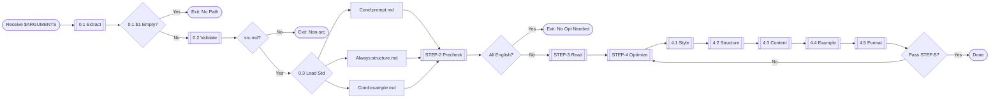

Optimize `AI Agent` memory prompt description, customize adjustment based on optional parameters. Optimize structure/format/content following rules, fix errors/redundancy/drafts, maintain traceability.

**Standard**: Strictly follow [_ai/meta/prompt.md](/_ai/meta/prompt.md).

## Workflow Diagram



## [STEP-0] Load/Parse

### [STEP-0.1] Extract
- Extract `$1` (Target Path) and `$2` (Custom Params).

### [STEP-0.2] Validate Type
- IF `$1` not `*.src.md` THEN error and exit.

### [STEP-0.3] Load Standards
- IF `$1`=`AGENTS.src.md` THEN Read [prompt.md](/_ai/meta/prompt.md).
- Read [structure.md](/_ai/meta/structure.md).
- IF `$1`!=`README.src.md` THEN Read [example.md](/_ai/meta/example.md).

## [STEP-1] Validate Param
- IF `$1` empty THEN error and exit.

## [STEP-2] Preconditions
- File exists and readable.
- IF all English THEN exit.
- IF format error THEN warn but continue.

## [STEP-3] Load Context
- Read content, understand structure/format/characteristics.

## [STEP-4] Optimization Workflow

### [STEP-4.1] Language/Style
- **Style**: US English logic + British Chinese + English terms.
- **Start**: 2-5 sentences overview.
- **Expression**: Concise and direct, no rhetoric.

### [STEP-4.2] Structure
- **Heading**: Max 3 levels (`#`, `##`, `###`).
- **Clean**: Remove redundant empty lines/headings/placeholders.
- **STEP**: Top level `## [STEP-N]`, Sub level `### [STEP-N.M]`.

```toon
examples[2]:
 - type: good-example
   description: Correct STEP
   content: |
     ## [STEP-0] Purpose
     ## [STEP-1] Scenario
     ### [STEP-1.1] Detail
 - type: bad-example
   description: Incorrect STEP
   content: |
     ## Optimization Rules
     0. STEP-0: Check
```

### [STEP-4.3] Content
- **Forbidden**: Emoji.
- **Terms**: `PascalCase`, `camelCase`, `snake_case`, `kebab-case`.
- **Structure**: Clearly present Role/Tasks/Constraints/Output.
- **Points**: Core 3-7 items, key points first.
- **Explicit**: No ambiguity, specific steps.

```toon
examples[2]:
 - type: good-example
   description: Concise Professional
   content: |
     WHEN file not exists, THEN exit and error.
 - type: bad-example
   description: Redundant Fancy
   content: |
     🎯 When finding file not exists, stop immediately and report friendly ✨
```

### [STEP-4.4] Example
- IF contains examples THEN Read [example.md](/_ai/meta/example.md).
- Follow TOON format.
- Atomic (One example one concept).

### [STEP-4.5] Format
- **Spec**: Follow [.editorconfig](/.editorconfig).
- **Punctuation**: English punctuation.
- **Line**: Ban body `---` (Except YAML).
- **Structure**: Reference paths must follow [structure.md](/_ai/meta/structure.md).

## [STEP-5] Quality Standards
- **Terms**: Unified.
- **Format**: Complete and standard.
- **Structure**: Clear hierarchy.
- **Example**: TOON format.
- **Concise**: No redundancy/empty lines/comments.
- **Readable**: Accurate and coherent.

## [STEP-6] Forbidden Actions
- NEVER modify unrequested parts.
- NEVER add unrequested content.
- NEVER delete important logic/constraints.
- NEVER change core semantics.
- NEVER introduce format errors.
