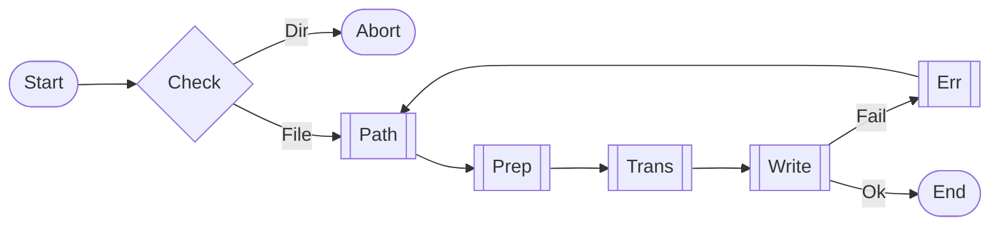

Compile single .src.md to English prompt. Validate/Parse/Translate. Supports `_ai/`, `_ai/.src/`, `ref/`, `skills/`.

## Constraints
- Single file only. Reject directory.
- `.src.md` only. Reject `AGENTS/CLAUDE.md`.
- Prefer `Write`, fail fallback to Shell.

## Workflow

## [STEP-0] Input
- `$1`: src path (req, `.src.md`). `$2`: desc (opt).
- Logic: Remove `@`. Reject directory/non-src.

## [STEP-1] Paths
- `_ai/src/` -> root/`dist/`. `AGENTS.src.md` -> `AGENTS.md`.
- `_ai/.src/` -> `_ai/`. `GLOBAL.src.md` -> `dist/GLOBAL.md`.
- `_ai/skills/**/` -> `dist/skills/**/`. `SKILL.src.md` -> `SKILL.md`.
- `_ai/commands/**/` -> `dist/commands/**/`. `*.src.md` -> `*.md`.
- `ref/**/src/` -> `ref/**/dist/`.
- Default: `*.src.md` -> `*.md`.

## [STEP-2] Prep
- Ensure dir. Overwrite. `TodoWrite`.

## [STEP-3] Trans
- `Read($1)`. Keep MD/code. Trans CN text/comments.
- Obsidian: `[[file|alias]]` -> `alias` (trans CN alias).

## [STEP-4] Write
- `Write`. Fail -> Shell (`Out-File`/`cat`).

## [STEP-5] Err
- Shell fail -> Log & Abort.

## [STEP-6] Quality
- **Term**: Match glossary.
- **Tech**: Accurate args.
- **Fmt**: Keep struct/indent.
- **Code**: Logic intact, trans comments.
- **Token**: Abbr, short phrases.
  - **Limits**: `cursor`<50k, `windsurf`<20k, `antigravity`<12k.
