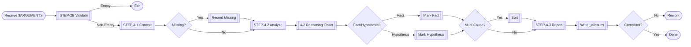

Called after task error. Output clarification report to `_aiissues/`, only analyze/organize evidence, do not fix. Follow Fact-Evidence-Reasoning structure.

## Workflow Diagram



## [STEP-0] Purpose
- Describe error scenario/background.
- Extract facts/evidence/hypotheses.
- Record missing info/suggestions.

## [STEP-1] Scenario
- AI violates requirements or errors.
- User provides `issue_description` (`$1`).
- Only clarify and record, do not fix.

## [STEP-2] Arguments

### [STEP-2A] issue_description (`$1`)
- Error description. MUST be non-empty.
- IF empty THEN error and exit.

### [STEP-2B] Validation
- Prioritize checking `$1`. Continue only if non-empty.

## [STEP-3] Preconditions
- Have traceable context.
- IF missing key info THEN record and stop inference.
- Forbidden to call tools that modify code/config.

## [STEP-4] Workflow

### [STEP-4.1] Context Intake
- Parse `$1` (Phenomenon/Condition).
- Collect context (Steps/Thinking/Input/Output/Logs/Files).
- Mark missing items.

### [STEP-4.2] Diagnose/Reason
- Build "Statement -> Phenomenon -> Evidence -> Reasoning" chain.
- Distinguish Fact/Hypothesis (Provide verification method).
- Sort multi-causes by credibility/impact.
- Cite exact evidence source.

### [STEP-4.3] Record Report
- Generate Markdown to `_aiissues/`.
- Filename: `Timestamp-Keyword.md` (e.g. `20251020-1432-prompt-conflict.md`).
- Self-check bans (No edit/No evidence conclusion).

## [STEP-5] Output Specs

### [STEP-5A] Sections
- **Model/Tools**: Empty.
- **User Input**: Cite original.
- **Report Error**: Cite description.
- **Execution Process**: List steps.

### [STEP-5B] File Handling
- Directory: `_aiissues/`. Encoding: UTF-8 LF.
- Tools: Only `Write`.
- Language: Simplified Chinese + British Logic + English Terms.

## [STEP-6] Forbidden Actions
- NEVER use Edit/ApplyPatch to modify repo.
- NEVER conclude/confirm without evidence.
- NEVER hide missing/error/warning.
- NEVER use as fix step.

## [STEP-7] Example

```toon
type: example
description: Report format
content: |
 Model:
 Tools:
 User Input: "Update AGENTS.src.md..."
 User Report Error: "Conflict with GLOBAL..."

 ## Execution Process
 1. Read [_ai/src/AGENTS.src.md](/_ai/src/AGENTS.src.md)
 2. Write ...
 3. User feedback conflict
```
