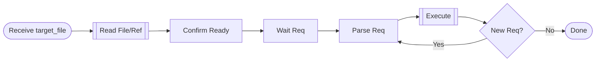

`pe_patch`: Deep collaborative editing. AI responds to user needs based on full context, executes iterative modifications. User-driven, fast loop.

## Workflow Diagram



## [STEP-0] Purpose
- Deep collaboration, iterative editing.
- AI understands context -> waits for instruction -> executes immediately.
- User fully in control.

## [STEP-1] Scenario
- Edit `_ai/` prompts.
- Complex content, needs context.
- Progressive/Iterative modification.

## [STEP-2] Arguments

### [STEP-2A] target_file (`$1`)
- Target path (`_ai/**/*.src.md`).
- IF empty THEN error and exit.

### [STEP-2B] Validation
- Prioritize checking `$1`. Check existence (ask to create if not exists).

## [STEP-3] Preconditions
- File exists/confirmed creation.
- Read/Write permission.
- Reference files accessible (`_ai/meta/*.md`).

## [STEP-4] Workflow

### [STEP-4.1] Load Context
- Read target file completely.
- Load references: `*.src.md` -> `example.xsd`/`structure.md`. Command -> Other commands.

### [STEP-4.2] Confirm Ready
- Explicitly inform: Read file, loaded references, ready for requests.
- Tone clear and friendly.

### [STEP-4.3] Iterative Loop
- Wait for request (Add/Mod/Del/Opt/Struct/Fmt).
- Parse -> Execute immediately (`Edit`/`Write`).
- Briefly explain change. Ask for next.
- Loop until done.

### [STEP-4.4] Principles
- **User-Driven**: No proactive suggestions, wait for instruction.
- **Immediate Execution**: No delay.
- **Precise Understanding**: No over-interpretation.
- **Concise**: Brief explanation.
- **Coherent**: Based on context.

## [STEP-5] Output Specs

### [STEP-5A] Style
- Simplified Chinese communication. Friendly/Professional/Efficient.
- Focus on execution, no over-explanation.

### [STEP-5B] Standards
- Format: [example.xsd](/_ai/meta/example.xsd).
- Structure: [structure.md](/_ai/meta/structure.md).
- Style: Consistency. British Logic Simplified Chinese + English Terms.

### [STEP-5C] Quality
- Confirm intent. Self-check format. Maintain structure/consistency.

## [STEP-6] Forbidden Actions
- NEVER proactively suggest (unless asked).
- NEVER unauthorized large-scale refactor.
- NEVER add unrequested content.
- NEVER modify unmentioned parts.
- NEVER delete existing content (unless requested).

## [STEP-7] Example

```toon
examples[3]:
 - type: good
   description: Collaboration flow
   user-input: "@pe_patch _ai/commands/pe_clarify-error.src.md"
   interactions[3]:
    - summary: |
        Read file and refs. Ready. Instructions: Add/Mod/Del/Opt/Struct/Fmt?
    - input: |
        Leave Model/Tools fields empty at start; Report no H1.
    - tooling:
       - name: Edit
         params: {path: ...}
      summary: |
        Done. 1.Add fields 2.Ban H1 3.Update example. Any more?
    - input: |
        Fields need colons.
    - tooling:
       - name: Edit
         params: {path: ...}
      summary: |
        Done. Fixed format. Any more?
 - type: bad
   description: Proactive suggestion
   user-input: "/pe_patch ..."
   summary: |
     I found issues: 1... 2... Suggest first...
     (Violates user-driven principle)
 - type: bad
   description: Unauthorized refactor
   user-input: "Optimize format"
   tooling[1]: {name: Write, params: ...}
   summary: |
     Refactored entire file...
     (Should ask specific requirements first)
```

## [STEP-8] Success Criteria
- User satisfied/done.
- Requirements fully implemented.
- Format standard/content accurate.
- Smooth experience.
